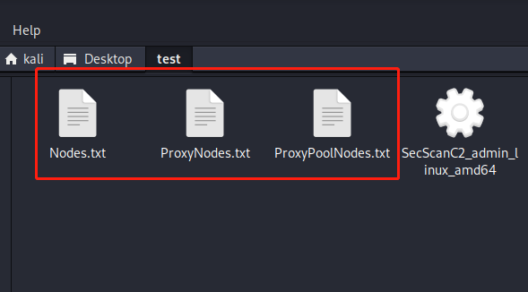
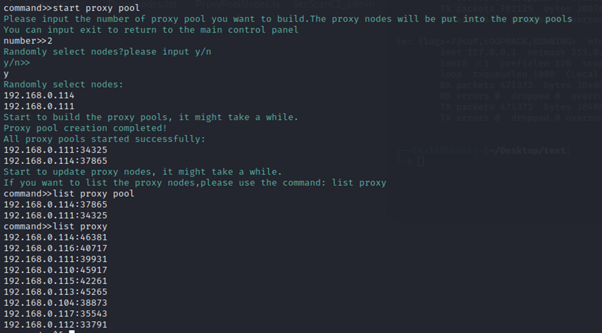
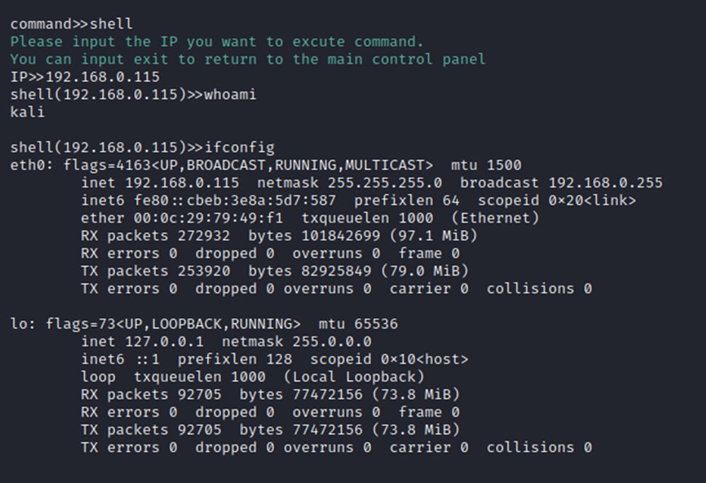

# SecScanC2

[中文说明](README_CN.md)

SecScanC2 can manage assetment to create P2P network for security scanning & C2. The tool can assist security researchers in conducting penetration testing more efficiently, preventing scanning from being blocked, protecting themselves from being traced. 

## Features

- **P2P**: build a large number of Internet nodes into a P2P network
- **Prevent scanning from being blocked**: randomly or specify nodes as proxy pools, all nodes in the P2P network will start a SOCKS proxy, and the proxies will be putted into the proxy pools. When we do detection and scanning, we can connect to the proxy pool, and the proxy pool will  randomly select proxy for every request.
- **Can effectively hide C2 servers to prevent traceability**: The decentralized structure adopts the publish-subscribe model to complete the information interaction of each node. The C2 node publishes the command to the P2P network. The command randomly selects  nodes in the network for multi-hop transmission. After the target node subscribes to the command, it executes the command and publishes the execution result of the command to the P2P network. The execution result randomly selects  nodes for multi-hop transmission. The C2 node finally subscribes to the command execution result. Throughout the process, the C2 node does not directly interact with the target node. So C2 node can avoid being traced.

## Usage

### Role

**SecScanC2 has two kinds of roles:**

**admin**: The admin node used by the penetration tester

**node**: The ordinary node deployed by the penetration tester

SecScanC2_admin: create a admin node.

SecScanC2_ node: create a ordinary node.

The startup parameters of both programs are the same.


### Parameter usage

```
Usages:
        ./SecScanC2_admin -k <key>
        ./SecScanC2_admin -k <key> -d <d> -dh <dh> -dl <dl>
  -d int
         Number of nodes directly connected.It must be dl < d < dh (default 2)
  -dh int
        Maximum number of nodes directly connected (default 3)
  -dl int
        Minimum number of nodes directly connected (default 1)
  -k string
        Key to connect with each node.It must be set and each node must be the same!‘
```


### Parameter analysis

**k:** **Required**.Key to connect with each node. **It must be set and each node must be the same**!

**d:** Optional. Number of nodes directly connected. It must be dl < d < dh. To reduce exposure, It is best to have fewer direct connections to the admin node. The default value of d for admin is 2.  To increase the difficulty of tracing, It is best to have more nodes directly connected to ordinary nodes. The default value of d for ordinary node is 6

**dh:** Optional. Maximum number of nodes directly connected. If we have more than dh peers, we will select some to prune from the mesh

**dl:** Optional. Minimum number of nodes directly connected.If we have fewer than dl peers, we will attempt to graft some more into the mesh


### Function introduction


When the above information appears on an ordinary node, it proves that the node has successfully started and connected to the P2P network.


When the above information appears on an admin node, it proves that the admin has successfully started and formed a P2P network. Admin will do some init work, include update the nodes, load the proxy pool nodes, load the proxy nodes and start web api server. You can see the generated files of nodes information in the current directory.




In the admin console, users can use these command as follows. User can input h to see all options

```
Options:
        h                                          show help information
        list node                                  list all nodes
        update node                                update all nodes
        start proxy pool                           start proxy pool nodes
        list proxy pool                            list all proxy pool nodes
        update proxy pool                          update proxy pool nodes
        start proxy                                start proxy nodes
        list proxy                                 list all proxy nodes
        update proxy                               update proxy nodes
        shell                                      execute system commands on given node
        exit                                       exit SecScanC2
```


**list node, update node, start proxy, list proxy**


**start proxy pool**

All nodes in the P2P network cans start a socks proxy. User can select several nodes as the proxy pools. Every time the proxy pool get a request ,it will select one socks proxy randomly.

Users can choose the number of nodes in the proxy pool, choose whether to randomly select nodes or specify nodes. If you choose Random, the system will randomly select the number of nodes specified by the user to generate the proxy pool. If you choose not to randomly, the user needs to enter a specified number of IP addresses, and the system will generate a proxy pool on the nodes with the specified IP. User can use command list proxy pool, list proxy to get the information of all proxy pools and proxyes.



When conducting scanning, we can set the local SOCKS proxy address as the listening address of the proxy pool node. From the logs of the proxy pool nodes, it can be seen that each request randomly selects a proxy node.


**shell**

Users can specify the controlled node to execute any command, requiring input of IP and command.



**Web API**

All operations can be called by the web API. Multiple people can operate remotely at the same time.Of course, for security reasons, each call will be identified by the parameter k , k is the value you input when start the admin node.

You can find the calling address of the web API in the startup information.


The homepage will list all API introductions


**All APIs:**

	/listNode?k=xxx
	/updateNode?k=xxx
	/startProxyPool?k=xxx&random=y&number=2
	/startProxyPool?k=xxx&random=n&number=2&ip=192.168.0.1_192.168.0.2
	/listProxyPool?k=xxx
	/updateProxyPool?k=xxx
	/startProxy?k=xxx
	/listProxy?k=xxx
	/updateProxy?k=xxx
	/shell?k=xxx&ip=x.x.x.x&cmd=xxx

For example：


## **References**

https://github.com/libp2p/go-libp2p

https://github.com/libp2p/go-libp2p-pubsub

https://github.com/libp2p/go-libp2p-kad-dht

https://github.com/pingc0y/go_proxy_pool

https://github.com/armon/go-socks5